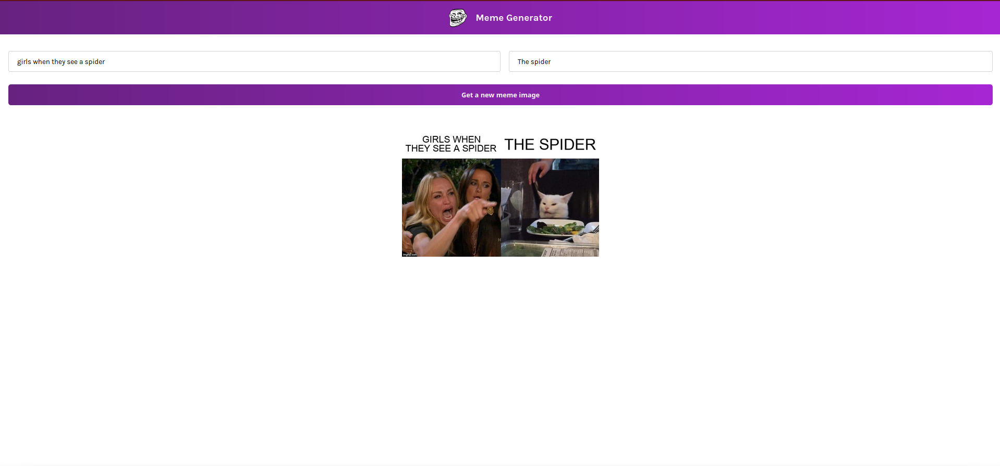

# Meme-Generator
&nbsp;


This project is based on scrimba tutorial project. I used **Imgflip API** to generate images to add caption. 

**Get start 🚀**

```
1. clone the project 
2. cd meme-generator
3. npm install 
4. create .env file for API request
5. https://imgflip.com/api (related documentation)
4. npm run dev
```

> I created project using vite so every .env file parameters must be starting with **VITE_**

`VITE_USERNAME=username` 

`VITE_PASSWORD=password`